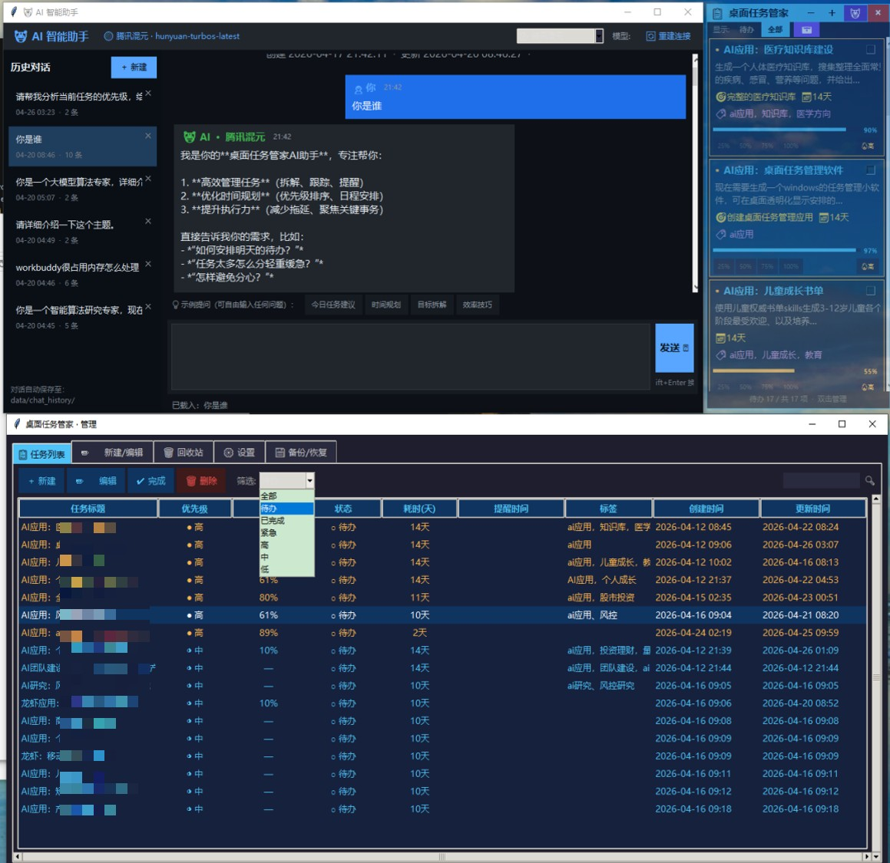
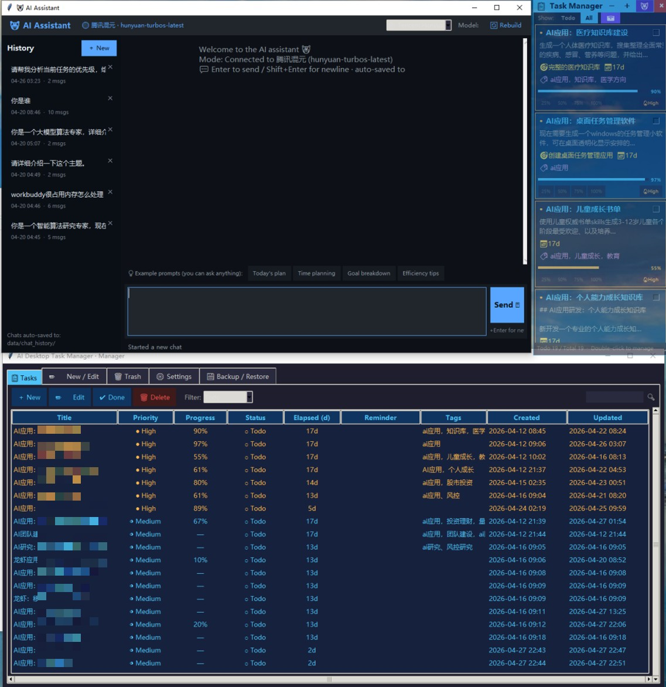

# 🖥️ AI Desktop Task Manager (桌面任务管家)

> 一个极简、低资源占用的跨平台桌面任务管理工具。集成多模型 AI 助手、Markdown 编辑器、桌面截图标注、闹钟提醒等实用功能，全部由 Python 标准库 + Tkinter 构建，**零强依赖、毫秒级启动、内存占用 ~20MB**。
>
> 支持 **Windows / macOS / Linux** 三大平台，界面提供 **🇨🇳 中文 / 🇺🇸 English** 双语，可在「设置」中一键切换，默认中文。

🌐 **Language**：[简体中文](./README.md) | [English](./README.en.md)

    

---

## 📸 界面预览

### 中文界面



### English UI



> 半透明悬浮窗（可拖拽 / 折叠 / **拖拽调整大小** / 调透明度） + 任务管理窗 + AI 对话窗 + 放大编辑器 + 桌面截图标注，一套串起来。

---

## ✨ 核心功能

### 🖥️ 桌面悬浮窗
- 始终置顶显示，可拖拽标题栏到屏幕任意位置
- **拖拽缩放**：右下角 `◢` 手柄可同时调整宽 / 高，最小 `280×180`，松手自动持久化到 `config.json`
- **透明度可调**（20% ~ 100%），不干扰工作
- **一键折叠**，只保留顶栏标题条
- **屏幕边界自动钳制**：跨屏拔副屏后窗口不会跑到屏外失踪
- 可选系统托盘图标（依赖 `pystray`，已自动降级）
- **跨平台开机自启动**：Windows 注册表 / macOS LaunchAgent / Linux `~/.config/autostart/*.desktop`，一键开关

### 🌐 多语言（i18n）
- 内置 **🇨🇳 简体中文** + **🇺🇸 English** 两套完整 UI 翻译
- 默认中文（`config.language = "zh_CN"`），在「设置 → 界面语言 / Language」下拉中可切到 `en_US`
- 切换后管理窗口、悬浮窗、AI 对话窗、托盘菜单立即用新语言重建，**无需重启**

### 📝 任务管理
- 任务支持：**标题 / 内容 / 优先级 / 截止日期 / 闹钟提醒 / 分类标签**
- 状态：未完成 / 已完成（可只看未完成）
- 按优先级颜色标记（🔴 高 / 🟡 中 / 🟢 低）
- 搜索、筛选、排序一应俱全
- **放大编辑器**：双击任务内容区打开独立窗口（1200×720），左编辑右预览
  - 支持搜索/替换、字号缩放（Ctrl+滚轮）、快捷键 Ctrl+S/Z/F
  - **Markdown 预览** 纯 Tk tag 实现（# / ## / **粗体** / *斜体* / `code` / > 引用 / - 列表 / [链接]）
  - **本地图片预览**：`` 可直接显示缩略图

### 🤖 AI 助手（多模型）
内置 **7 个主流 AI 服务商** 配置模板，一键切换：

| Provider | 说明 | 费用 |
|----------|------|------|
| 🐉 **腾讯混元** | `hunyuan-turbos-latest`，中文优化，内置 DEMO Key 可零配置即用 | 免费额度 |
| 🟢 **Ollama 本地** | 完全离线运行，默认模型 `qwen2:7b` | 免费（需本地部署） |
| ⚡ **Groq** | `llama3-8b-8192`，推理极快 | 免费额度较大 |
| 🔵 **DeepSeek** | `deepseek-chat`，代码能力强 | 低价 |
| 🌙 **Moonshot** | `moonshot-v1-8k`，长上下文 | 付费 |
| 🤖 **OpenAI** | `gpt-4o-mini` 等 | 付费 |
| 🔧 **自定义** | 任意 OpenAI 兼容 API | 取决于服务 |

**特性**：
- **SSE 流式输出**：回复逐字打字，支持中途停止
- **持久化会话**：每次对话自动保存到 `data/chat_history/`
  - 左侧会话列表可查看/删除/切换，类似 ChatGPT
- **系统提示词可定制**：在设置中自定义人设
- **请求透传**：`extra_body` 支持（例如混元的 `enable_enhancement`）

### 📷 桌面截图 & 标注
- 全屏半透明遮罩 → 拖拽选区 → 进入标注编辑器
- **标注工具**：矩形、椭圆、箭头、画笔、文字、马赛克
- 颜色盘 + 粗细滑块、撤销/重做/清空
- 快捷键：Ctrl+Z/Y（撤销/重做）、Ctrl+S（保存）、Esc（退出）
- **多屏 + HiDPI 适配**（启动前自动开启 DPI Awareness）
- **自动插入任务**：截图保存后直接追加到当前编辑的任务内容中
- **全局热键**：`Ctrl+Alt+A`（需安装 `keyboard` 库）

### ⏰ 闹钟提醒
- 每分钟精确检测一次（自动对齐系统时钟）
- 到点弹窗 + 可选声音提醒
- 支持"提前 N 分钟"

### 💾 备份 / 邮件导出
- 一键把 `tasks.json` + 对话历史打包为 zip
- 可选通过 SMTP 邮件发送（默认 QQ 邮箱 465 SSL）
- 支持主流服务商：QQ/163/126/Gmail/Outlook/新浪/Yahoo 一键选择
- 可选是否包含 `config.json`（敏感字段自动脱敏）

---

## 🗂️ 项目结构

```
ai-desktop-task-manager/
├── src/                         # ─── 所有 Python 源代码 ───
│   ├── main.py                  # 程序入口
│   ├── i18n.py                  # 多语言（zh_CN / en_US）翻译表
│   ├── platform_utils.py        # 跨平台工具（DPI / beep / autostart）
│   ├── config.py                # 配置加载/保存
│   ├── models.py                # 任务数据模型 & Store
│   ├── overlay.py               # 桌面悬浮窗
│   ├── manager.py               # 任务管理窗
│   ├── ai_window.py             # AI 对话窗
│   ├── ai_chat.py               # AI 后端抽象（OpenAI/Ollama）+ 会话持久化
│   ├── markdown_editor.py       # 放大编辑器（MD 预览 + 搜索替换）
│   ├── screenshot.py            # 桌面截图 & 标注
│   ├── alarm.py                 # 闹钟提醒（跨平台 beep）
│   ├── backup.py                # 备份 & 邮件导出
│   └── autostart.py             # 开机自启动（兼容层，转发到 platform_utils）
│
├── scripts/                     # ─── 所有可执行脚本（启动 / 安装 / 维护）───
│   ├── run.py                   # ★ 跨平台 Python 启动器（带崩溃日志）
│   ├── start.bat                # Windows 启动（pythonw 静默 + --console 排错）
│   ├── start.sh                 # Linux / macOS Shell 启动
│   ├── start.command            # macOS Finder 双击启动
│   ├── install_deps.bat         # Windows 一键装可选依赖
│   ├── install_deps.sh          # Linux / macOS 一键装可选依赖
│   └── _sync_img.py             # 维护：把 README/图片同步到 GitHub（开发者用）
│
├── start.bat                    # ★ 根目录便捷入口（转发 scripts\start.bat）
├── start.sh                     # ★ 根目录便捷入口（转发 scripts/start.sh）
│
├── config/
│   ├── config.example.json      # 配置模板（入库）
│   └── config.json              # 本地真实配置（含 Key，.gitignore，首次启动自动生成）
├── data/                        # 运行数据（.gitignore）
│   ├── tasks.json               # 任务列表
│   ├── chat_history/            # AI 会话 JSON
│   └── img/YYYYMMDD/            # 截图按日期归档
├── logs/                        # 运行时日志（.gitignore，崩溃自动写入）
│   └── runtime.log              # 静默崩溃堆栈（pythonw 模式排错用）
├── img/                         # README 展示图（入库）
│   ├── ai_task_manager_01.jpg   # 中文 UI 预览
│   └── ai_task_manager_02.jpg   # English UI preview
│
├── requirements.txt             # 可选依赖清单
├── README.md                    # 中文文档
├── README.en.md                 # English documentation
├── LICENSE
└── .gitignore
```

> 📐 **目录约定**：`src/` = 所有源代码；`scripts/` = 所有可执行脚本；根目录只放标准元数据（README/LICENSE/requirements）+ 数据目录（config/data/logs/img）+ 双击便捷入口（start.bat / start.sh）。

---

## 🚀 快速开始

### 1. 环境要求

| 平台 | Python | Tkinter | 备注 |
|------|--------|---------|------|
| Windows 10/11 | 3.8+（[官方下载](https://www.python.org/downloads/windows/)） | 自带 | 推荐 64-bit |
| macOS 11+ | 3.8+（`brew install python@3.12`） | `brew install python-tk` | Apple Silicon 原生支持 |
| Ubuntu/Debian | 3.8+（`sudo apt install python3`） | `sudo apt install python3-tk` | 需要 X11 / Wayland |
| Fedora | 3.8+（`sudo dnf install python3`） | `sudo dnf install python3-tkinter` | — |
| Arch / Manjaro | 3.8+（`sudo pacman -S python`） | `sudo pacman -S tk` | — |

> 核心运行 **零依赖**（只需 Python 标准库 + Tkinter）。可选依赖：`pillow`（截图与图片预览）、`pystray`（系统托盘）、`keyboard`（全局热键，Linux 需 root，macOS 需辅助功能权限）。

### 2. 克隆

```bash
git clone https://github.com/fxlsunny/ai-desktop-task-manager.git
cd ai-desktop-task-manager
```

### 3. 启动 — 三平台一键脚本

| 平台 | 启动方式 | 安装可选依赖 |
|------|----------|--------------|
| **Windows** | 双击根目录 `start.bat`（前台排错：`start.bat --console`） | 双击 `scripts\install_deps.bat` |
| **macOS**   | 双击 `scripts/start.command`（首次需 `chmod +x scripts/start.command`） | `bash scripts/install_deps.sh` |
| **Linux**   | `./start.sh`（首次 `chmod +x start.sh scripts/*.sh`）<br>前台调试：`./start.sh --console` | `./scripts/install_deps.sh` |

或者通用命令行（所有平台一致）：

```bash
# 推荐：使用跨平台启动器
python scripts/run.py             # 自动隐藏控制台（Windows pythonw）
python scripts/run.py --console   # 强制保留控制台（看日志）

# 或者直接运行 src/main.py
python src/main.py
```

> 首次启动会自动从 `config/config.example.json` 生成 `config/config.json`。在程序设置中填入 API Key 即可。

### 4. 切换 UI 语言（中 / English）

启动程序 → `📋 打开管理器` → `⚙️ 设置` → 找到 **「界面语言 / Language」** 下拉框 → 选择 `English` 保存即可，管理窗口会自动用新语言重建，**无需重启**。

### 5. 开机自启动

在 `⚙️ 设置` 中勾选 **「开机自启动 / Run at startup」**，三平台分别：

| 平台 | 实现方式 | 文件位置 |
|------|----------|----------|
| Windows | 写入注册表 `HKCU\Software\Microsoft\Windows\CurrentVersion\Run` | — |
| macOS  | 创建 LaunchAgent | `~/Library/LaunchAgents/com.fxlsunny.DesktopTaskManager.plist` |
| Linux  | 创建 freedesktop autostart | `~/.config/autostart/DesktopTaskManager.desktop` |

> 取消勾选会自动清理对应文件 / 注册表项，保持系统干净。

---

## 🐧🍎 跨平台部署详解

### Windows
```powershell
git clone https://github.com/fxlsunny/ai-desktop-task-manager.git
cd ai-desktop-task-manager
scripts\install_deps.bat   # 可选
start.bat                  # 双击根目录的 start.bat 也可
```

### macOS
```bash
brew install python@3.12 python-tk
git clone https://github.com/fxlsunny/ai-desktop-task-manager.git
cd ai-desktop-task-manager
chmod +x start.sh scripts/start.sh scripts/start.command scripts/install_deps.sh
bash scripts/install_deps.sh   # 可选
./start.sh                     # 或在 Finder 双击 scripts/start.command
```
> macOS Big Sur 及以上首次双击 `scripts/start.command` 时若提示「无法打开」，请在 *系统设置 → 隐私与安全性* 中点击「仍要打开」。

### Linux（Ubuntu/Debian 示例）
```bash
sudo apt update
sudo apt install -y python3 python3-tk python3-pip git
git clone https://github.com/fxlsunny/ai-desktop-task-manager.git
cd ai-desktop-task-manager
chmod +x start.sh scripts/start.sh scripts/install_deps.sh
./scripts/install_deps.sh   # 可选
./start.sh
```
> Wayland 桌面（GNOME 42+）下截图功能依赖 `xdg-desktop-portal` 或在 X11 会话下使用更稳定。
> 系统托盘需要安装 `gir1.2-appindicator3-0.1`（GNOME）或 KDE 自带的 SNI 支持。

### 通过 Docker / 远程桌面
程序是纯桌面应用，运行需要图形会话。如需在服务器运行，建议配合：
- **VcXsrv / X410**（Windows 转发 X11）
- **xrdp / VNC**（Linux 远程桌面）
- **macOS 屏幕共享**

---

## ⚙️ AI 模型配置

### 方式 1：修改 `config/config.json`（不会入库）

打开 `config/config.json`，找到 `ai.providers.<你想用的服务商>.api_key`，填入你的 Key：

```jsonc
{
  "ai": {
    "active_provider": "hunyuan",        // 默认使用腾讯混元
    "providers": {
      "hunyuan": {
        "label": "腾讯混元",
        "api_key": "sk-your-hunyuan-key-here",
        "base_url": "https://api.hunyuan.cloud.tencent.com/v1",
        "model": "hunyuan-turbos-latest"
      },
      "deepseek": {
        "label": "DeepSeek",
        "api_key": "sk-your-deepseek-key",
        "base_url": "https://api.deepseek.com/v1",
        "model": "deepseek-chat"
      }
      // ... 其它服务商
    }
  }
}
```

### 方式 2：在程序 UI 里配置（推荐）

启动程序 → 点击 `⚙️ 设置` → 切换到 `🤖 AI 配置` → 下拉选择服务商 → 填入 Key → 保存。

### 方式 3：使用本地 Ollama（完全免费离线）

1. 安装 [Ollama](https://ollama.com)，运行 `ollama pull qwen2:7b`
2. 在 `config/config.json` 里把 `ai.prefer_ollama` 设为 `true`
3. 启动程序，AI 助手会优先走本地 Ollama

### 🔑 获取 API Key 的渠道

| 模型 | 获取地址 | 备注 |
|------|---------|------|
| 腾讯混元 | https://cloud.tencent.com/product/hunyuan | 新用户有免费 Token 额度 |
| Groq | https://console.groq.com/keys | 免费额度充足，推理极快 |
| DeepSeek | https://platform.deepseek.com/api_keys | 低价高质量，国内可直连 |
| Moonshot | https://platform.moonshot.cn/console/api-keys | 新用户赠送额度 |
| OpenAI | https://platform.openai.com/api-keys | 需海外信用卡 |

---

## ⌨️ 快捷键

### 全局
| 快捷键 | 功能 |
|--------|------|
| `Ctrl+Alt+A` | 桌面截图（需 `pip install keyboard`） |

### 放大编辑器（双击任务内容打开）
| 快捷键 | 功能 |
|--------|------|
| `Ctrl+S` | 保存 |
| `Ctrl+Z / Y` | 撤销 / 重做 |
| `Ctrl+F` | 搜索 |
| `Ctrl++ / -` | 放大 / 缩小字号 |
| `Ctrl+滚轮` | 缩放字号 |
| `Esc` | 关闭 |

### 截图标注
| 快捷键 | 功能 |
|--------|------|
| `Ctrl+Z / Y` | 撤销 / 重做 |
| `Ctrl+S` | 保存并插入 |
| `Esc` | 取消 |

---

## 🛡️ 隐私与安全

- **所有数据 100% 本地存储**：任务、对话记录、截图都在 `data/` 目录，不会上传到任何云端
- **API Key 仅用于调用对应 AI 服务商**，程序本身不收集、不上传任何信息
- **配置文件 `config/config.json` 已加入 `.gitignore`**，不会意外上传到仓库
- 如要同步任务到其它设备，可用"备份 → 邮件发送"功能手动同步

---

## 🧪 开发 / 调试

```bash
# 前台启动（能看 print 输出）
python src\main.py

# 单独测某模块
python -c "import sys; sys.path.insert(0,'src'); import config; print(config.load())"
```

### 代码架构速查

- 主循环在 `main.py::main()`，用 Tk mainloop 驱动
- 任务数据流：`models.Store` ← → `data/tasks.json`（原子写入）
- AI 后端抽象：`ai_chat.py` 里 `OllamaBackend` / `OpenAICompatBackend` 实现统一 `stream(messages)` 接口
- 悬浮窗与管理窗通过回调解耦，`_on_cfg_saved` 负责配置变更后的整体刷新

---

## ❓ FAQ

**Q1. 为什么悬浮窗没有透明效果？**  
A. Windows 需要显卡支持 `WS_EX_LAYERED`，几乎所有 Win10/11 机器都支持；如果是远程桌面场景可能被降级，改用"可调透明"滑块即可。

**Q2. 截图后图片保存在哪？**  
A. `data/img/YYYYMMDD/HHMMSS_xxx_桌面管理.jpg`，按日期归档；任务内容里插入的是**相对路径**，即使迁移 data 目录也不坏图。

**Q3. AI 回复很慢？**  
A. 检查三个方向：
- 网络：部分海外 API（OpenAI / Groq）需要科学上网
- 服务商：切换到国内的腾讯混元 / DeepSeek
- 本地：启用 Ollama，离线运行完全无延迟

**Q4. 能不能同步到手机？**  
A. 目前没做移动端；可用"备份 → 邮件发送 zip"功能把 tasks.json 传到手机查看。

**Q5. 能否打包成 exe / .app / AppImage？**  
A. 可以，用 PyInstaller：  
```bash
# Windows
pyinstaller --noconsole --onefile --add-data "config/config.example.json;config" --name "DesktopTaskManager" scripts/run.py

# macOS（生成 .app）
pyinstaller --noconsole --onefile --windowed --add-data "config/config.example.json:config" --name "DesktopTaskManager" scripts/run.py

# Linux（生成可执行文件，再用 appimagetool 打成 AppImage 即可）
pyinstaller --onefile --add-data "config/config.example.json:config" --name "DesktopTaskManager" scripts/run.py
```

**Q6. 怎么切换到英文界面？**  
A. 启动程序 → `📋 打开管理器` → `⚙️ 设置 / Settings` → 找到 **「界面语言 / Language」** 下拉，选择 `English` 后点击 **「💾 保存所有设置」**。语言切换后管理窗口会自动重建，所有 UI（任务列表 / 编辑表单 / 设置 / 备份 / 截图 / AI 助手 / 悬浮窗 / 托盘菜单）实时切换；下次打开 AI 对话窗时也会用新语言。

**Q7. macOS 双击 `start.command` 提示「无法验证开发者」？**  
A. 这是 Gatekeeper 的默认拦截。在 *系统设置 → 隐私与安全性* 底部点击「仍要打开」，或终端执行：
```bash
xattr -d com.apple.quarantine scripts/start.command
```

**Q8. Linux 上系统托盘图标看不到？**  
A. GNOME 默认不显示传统托盘，需安装扩展：
- **GNOME**：安装 [AppIndicator and KStatusNotifierItem Support](https://extensions.gnome.org/extension/615/appindicator-support/) 扩展
- **KDE / XFCE / Cinnamon**：开箱即用，无需额外操作

**Q9. Windows 双击 `start.bat` 没有反应 / 一闪而过？**  
A. `start.bat` 默认走 `pythonw.exe`（无控制台、无窗口），便于日常使用。若启动失败请按以下顺序排查：
1. **改用控制台模式**实时看错误：在终端中执行 `start.bat --console`（根目录或 `scripts\start.bat --console` 都可以）。
2. **查看崩溃日志**：`scripts/run.py` 已自动把未捕获异常写入 `logs/runtime.log`，含完整堆栈。
3. **检查悬浮窗是否飞屏外**：换屏 / 拔掉副屏后 `config/config.json` 里的 `overlay_x` / `overlay_y` 可能指向已不存在的坐标。本仓库已加入屏幕边界自动钳制，但若仍异常可手动把这两个值改成 `20` / `100`。
4. **缺 Tkinter**：极少见——重新运行 Python 安装包，勾选 `tcl/tk and IDLE` 组件。
5. **Python 版本过低**：需要 Python 3.8+。终端 `python --version` 验证。

**Q10. 桌面悬浮窗可以拖动调整大小吗？**  
A. 可以。悬浮窗右下角有一个 `◢` 缩放手柄，按住拖动即可同时调整宽高，松开后会自动保存到 `config.json`。最小尺寸 `280×180`，保证标题栏的最小化 / 加号 / AI / 关闭四个基础按钮始终可见。

---

## 📋 路线图

- [x] 多模型 AI 助手 + 会话持久化
- [x] 放大编辑器 + Markdown 预览
- [x] 桌面截图标注 + 任务内联
- [x] 邮件备份
- [x] **跨平台支持**（Windows / macOS / Linux）
- [x] **多语言 UI**（中文 / English）
- [x] **悬浮窗可拖拽调整大小**
- [ ] 更多语言（日 / 韩 / 法 / 德…欢迎 PR）
- [ ] 云同步（WebDAV / S3）
- [ ] 移动端查看（只读 Web）
- [ ] 任务看板（Kanban）视图
- [ ] 番茄钟集成

---

## 🤝 贡献

欢迎 issue / PR。代码风格：
- Python 标准库优先，避免引入重型依赖
- 新增功能必须"可降级"：缺少可选依赖时只提示、不崩溃
- 每个 UI 文件保持单一职责（窗口/组件一一对应）

---

## 📜 License

[MIT License](./LICENSE) © 2026 fxlsunny
